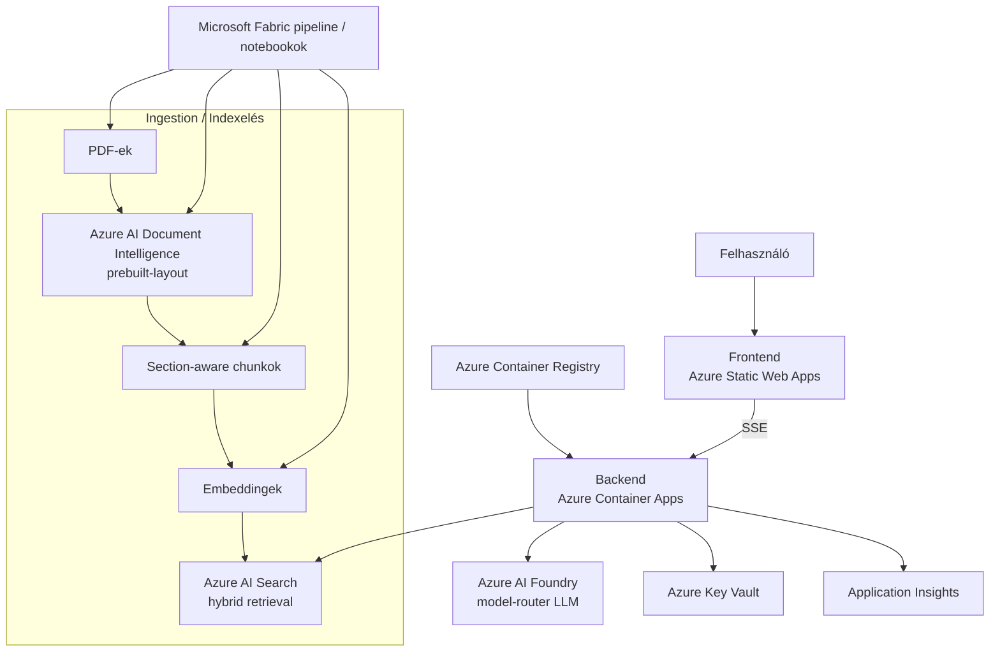

# NAV Információs Asszisztens — RAG Chatbot

> ⚠️ **Arculati megjegyzés**: Ez a projekt saját, NAV-inspirált vizuális arculatot használ (kék/fehér színvilág). A hivatalos NAV logó és állami szimbólumok nem kerültek felhasználásra jogi megfontolásból.

Az asszisztens a 2021–2026 közötti adóéveket támogatja. Az adóév kiválasztható a felületen; év nélküli kérdésnél a chatbot visszakérdez. Minden válasz saját adóév-jelvényt kap, ezért ugyanazon beszélgetésen belül is biztonságosan váltható az év.

## Architektúra



## Technológiai stack

| Komponens | Technológia |
|-----------|------------|
| Backend | Python 3.11, FastAPI, SSE streaming |
| Frontend | React 18, Vite, TypeScript |
| LLM | Azure AI Foundry (model-router) |
| Embedding | text-embedding-3-large (3072 dim) |
| Retrieval | Azure AI Search (hybrid: vector + BM25 + semantic ranker) |
| PDF feldolgozás | Azure AI Document Intelligence (prebuilt-layout) |
| Adat-pipeline | Microsoft Fabric notebooks, Delta Lake |
| Hosting | Azure Container Apps + Static Web Apps |
| IaC | Bicep, azd |
| CI/CD | GitHub Actions (OIDC) |
| Megfigyelhetőség | Application Insights |

## Régió

`swedencentral` — Az összes szükséges szolgáltatás elérhető (AI Foundry model-router, text-embedding-3-large, Document Intelligence prebuilt-layout, AI Search semantic ranker).

## Előfeltételek

- Azure subscription (Contributor + User Access Administrator)
- Azure CLI + azd CLI
- Python 3.11+
- Node.js 20+
- Docker (lokális fejlesztéshez)
- GitHub CLI (`gh`)
- Microsoft Fabric kapacitás (F4 vagy magasabb)

## Gyors indítás

### Lokális fejlesztés
```bash
# Backend
cd backend && pip install -e ".[dev]" && uvicorn app.main:app --reload

# Frontend
cd frontend && npm install && npm run dev

# Docker Compose (teljes stack)
docker compose up
```

### Azure deployment
```bash
azd auth login
azd init
azd up
```

Az API chatkérése kötelező `adoev` mezőt vár:

```json
{"message": "Mikor kell beadni a bevallást?", "adoev": 2024}
```

## Projekt struktúra

```text
navchatbotprod/
├─ backend/          # FastAPI API, SSE chat endpoint, retrieval és LLM szolgáltatások
├─ frontend/         # React + Vite kliensalkalmazás
├─ fabric/           # Ingest, chunking, embedding, indexing és eval notebookok
├─ infra/            # Bicep infrastruktúra (Search, Foundry, KV, ACA, SWA, Fabric)
├─ docs/             # Működési és architekturális dokumentáció
├─ evals/            # Értékelő kérdés-válasz datasetek
├─ data/             # Lokális / bemeneti adatfájlok
├─ docker-compose.yml
└─ azure.yaml        # azd projektleírás
```

## Ismert blokkolók

_TBD – deployment közben frissítendő._

## Költségbecslés

Becsült havi költség (nagyságrendi, használattól függően):

- AI Search Standard: ~$250/month
- Container Apps: ~$50/month
- Static Web Apps: ~$9/month (Standard)
- AI Foundry (model-router): usage-based (~$10-50/month depending on volume)
- Document Intelligence: usage-based (~$5-20 for initial processing)
- Fabric F4: ~$260/month (can be paused)
- Key Vault, App Insights: ~$5-10/month
- **Total estimate: ~$600-650/month** (Fabric running), ~$340-390/month (Fabric paused after indexing)

## Licenc

MIT
