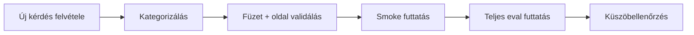

# Értékelési stratégia

## Eval dataset

A projekt kanonikus értékelő datasetjei:

- `evals/qa.jsonl` — **100 kérdéses** teljes értékelő készlet
- `evals/qa.smoke.jsonl` — **20 kérdéses** smoke készlet gyors ellenőrzéshez

Ajánlott, hogy minden rekord egy JSON objektum legyen külön sorban:

```json
{"question":"Mikor kell beadni az SZJA bevallást?","expected_answer":"...","expected_fuzet":"01","expected_page":12,"category":"szja"}
```

## Kategóriák

A kérdéseket legalább az alábbi taxonómiával érdemes címkézni:

- szja
- áfa
- kata
- tao
- szocho
- tbj
- ekho
- illeték
- jövedéki
- egyéb

Ez lehetővé teszi a tematikus hibakeresést és a regressziók gyorsabb észlelését.

## Metrikák és küszöbök

| Metrika | Küszöb | Leírás |
|---------|--------|--------|
| Groundedness | ≥ 4.0/5 | A válasz a kontextusból származik |
| Relevance | ≥ 4.0/5 | A válasz releváns a kérdésre |
| Fluency | ≥ 4.0/5 | Nyelvtanilag helyes, olvasható |
| Citation correctness | ≥ 0.8 | Helyes füzet + oldal hivatkozás |

Kiegészítő retrieval metrikák:

- `document_recall@3`
- `chunk_recall@5`
- `chunk_recall@10`

## Lokális futtatás (Fabric notebook)

A `fabric/notebooks/04_eval_notebook.py` notebook RAGAS-szerű, lokális retrieval-orientált ellenőrzést végez.

Mit mér:

- document recall@3
- chunk recall@5
- chunk recall@10
- citation correctness
- answer relevance

Ajánlott futtatás:

1. a friss indexre futtasd,
2. először smoke dataseten,
3. majd teljes `qa.jsonl` készleten.

Példa konfiguráció:

```bash
export EVAL_DATASET_PATH=evals/qa.smoke.jsonl
```

A notebook Delta táblába írja az eredményeket (`eval_results`), így historikus összehasonlítás is kialakítható.

## Pipeline eval (Foundry Cloud Evaluation)

A deployment pipeline részeként javasolt automatikus **Foundry Cloud Evaluation** futtatás:

1. a candidate build friss indexet használ,
2. lefut a smoke vagy teljes eval csomag,
3. a pipeline metrikákat hasonlít a küszöbökhöz,
4. csak siker esetén történik forgalomterelés.

A többmodelles, költség- és latency-összehasonlítást a külön, manuális
[`Model benchmark`](model-benchmark.md) workflow végzi. Ez nem része a release
traffic-shift folyamatnak.

## Quality gate

A release csak akkor léphet tovább, ha minden kötelező küszöb teljesül.

Szabály:

- ha **bármelyik metrika** a küszöb alá esik,
  - a deploy pipeline **megbukik**,
  - az új Container Apps revízió **nem kap forgalmat**,
  - a korábbi stabil revízió marad aktív.

Ez különösen fontos hallucination, hibás hivatkozás vagy retrieval regresszió esetén.

## Eval dataset bővítése

Új kérdések felvételekor kövesd ezeket a szabályokat:

1. **Egy sor = egy JSON objektum**.
2. Kötelező mezők:
   - `question`
   - `expected_answer`
   - `expected_fuzet`
   - `expected_page`
   - `category`
3. A kérdés legyen valós felhasználói megfogalmazású, természetes magyar nyelven.
4. A várt válasz legyen forrásalapú, ne túl hosszú, de ellenőrizhető.
5. A hivatkozott füzet és oldal legyen egyértelműen validálható.
6. Törekedj egyensúlyra a kategóriák között.
7. Legyenek benne:
   - rövidítések (`szja`, `áfa`, `kata`)
   - többmondatos kérdések
   - határidős kérdések
   - kivétel- és feltételjellegű kérdések
   - táblázatból megválaszolható esetek

## Javasolt bővítési workflow



## Ismert limitációk

- **Magyar morfológia**: ragozott alakok és összetett szavak miatt a lexical recall ingadozhat.
- **Kereszthivatkozások feloldása**: amikor egy füzet másik füzetre utal, a válaszhoz néha több dokumentum együttes kontextusa szükséges.
- **Táblázatértelmezés**: összetett táblák esetén a Markdown-konverzió veszteséges lehet.
- **Oldalszintű citation scoring**: ha a releváns információ oldalpáron terül szét, a szigorú page-match alulbecsülheti a minőséget.

## Minimum release checklist

- smoke eval lefutott
- teljes eval lefutott
- citation correctness elérte a küszöböt
- relevance / groundedness / fluency megfelel
- nincs kategória-specifikus regresszió (pl. áfa vagy szja)
