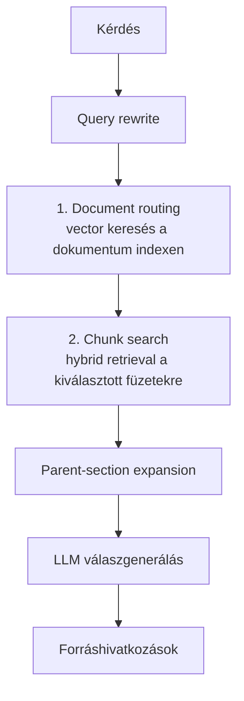

# Retrieval architektúra

Ez a dokumentum a NAV 2026 információs füzetek feldolgozásának és visszakeresésének működését írja le.

## Feldolgozási áttekintés



## PDF feldolgozás

A PDF-ek feldolgozása Microsoft Fabric notebookból történik az Azure AI Document Intelligence `prebuilt-layout` modelljével.

Fő lépések:

1. A nyers PDF-ek a Lakehouse `Files/raw/2026/` útvonalára kerülnek.
2. A `prebuilt-layout` futtatás `MARKDOWN` kimenettel történik, `hu-HU` locale mellett.
3. A rendszer bekezdéseket, címsorokat és táblákat külön kezeli.
4. A címsorokból hierarchikus breadcrumb épül.
5. A táblák Markdown formára alakulnak, hogy a sor/oszlop-szerkezet megmaradjon retrieval és LLM használatra is.

## Chunking stratégia

A chunkolás **section-aware** módon történik:

- célméret: ~700 token
- overlap: ~100 token
- a chunk határait elsősorban a szekcióstruktúra vezérli
- a táblák egyben maradnak, külön `content_type=table` chunkként
- a lábjegyzetek a környező szekció kontextusába olvadnak be
- minden chunk tartalmazza a breadcrumbot is, nem csak a törzsszöveget

Gyakorlati szabályok:

- új heading esetén a szöveges buffer flush-olódik
- mondat-alapú összefűzés történik a tokenlimitig
- overlap a lezárt chunk végéről épül újra
- egy találatból később parent-section bővítés történik

## Metadata

A chunk- és dokumentumszintű indexeléshez az alábbi metaadatok fontosak:

| Mező | Jelentés |
|------|----------|
| `fuzet_szam` | Az információs füzet sorszáma |
| `fuzet_cim` | A füzet címe |
| `breadcrumb` | Szekcióútvonal / címsor-hierarchia |
| `page_from` / `page_to` | Oldaltartomány |
| `kozzeteve` | Közzétételi dátum |
| `hivatkozott_fuzetek` | Más füzetekre mutató hivatkozások |
| `summary` | Rövid, magyar nyelvű retrieval-összefoglaló |

## Embedding

Az embedding modell: `text-embedding-3-large`, **3072 dimenzióval**.

A beágyazás nem csak a nyers tartalmon készül, hanem ezen az összeállított inputon:

```text
breadcrumb + summary + content
```

Ez javítja:

- a heading-alapú visszakeresést,
- a rövid kérdések feloldását,
- a magyar adózási terminológia recallját.

## Kétlépcsős retrieval

### 1. Document routing

Először a **documents indexen** történik vektorkeresés, amely a legvalószínűbb füzeteket rangsorolja.

- keresés típusa: vector search
- cél: top-3 releváns füzet kiválasztása
- output: `fuzet_szam` lista a 2. lépés szűréséhez

### 2. Chunk search

Ezután a **chunks indexen** fut a tényleges keresés, már csak a kiválasztott füzetekre szűrve.

Összetevők:

- **HNSW cosine** vektorkeresés
- **BM25** teljes szöveges keresés `hu.microsoft` analyzerrel
- **RRF** (Reciprocal Rank Fusion) jellegű hybrid összevonás az AI Search natív hibrid működésével
- **semantic ranker** a végső sorrendezéshez

A szűrés `search.in(fuzet_szam, ...)` formában történik, így a chunk keresés nem az összes füzeten fut.

## Parent-section expansion

A chunk találatok után a rendszer nem áll meg az egyedi chunknál.

Működés:

1. a találat breadcrumbja alapján meghatározza a parent section prefixet,
2. ugyanazon füzet(ek)ből begyűjti az azonos szekcióhoz tartozó további chunkokat,
3. a LLM már a kibővített szekciókontextust kapja meg.

Ez különösen hasznos:

- felsorolások,
- kivételek,
- lábjegyzetek,
- táblázat + magyarázó bekezdés együtt kezelése esetén.

## Szinonima-térkép

A keresés és query rewrite az alábbi rövidítéseket kezeli kiemelten:

| Rövidítés | Feloldás |
|-----------|----------|
| `szja` | személyi jövedelemadó |
| `áfa` | általános forgalmi adó |
| `kata` | kisadózó vállalkozók tételes adója |
| `ekho` | egyszerűsített közteherviselési hozzájárulás |
| `tao` | társasági adó |
| `szocho` | szociális hozzájárulási adó |
| `tbj` | társadalombiztosítási járulék |

A synonym map az Azure AI Search indexben is megjelenik, így a rövid és hosszú alakok kölcsönösen segítik a visszakeresést.

## Query rewrite

A query rewrite célja a magyar adózási rövidítések és összetett kérdések kezelése.

Fő szabályok:

- rövidítésfeloldás (`szja` → `szja (személyi jövedelemadó)`)
- több kérdés szétbontása önálló lekérdezésekre
- számozott kérdéslisták felismerése
- whitespace-normalizálás

Példák:

- `Mi az szja és az áfa?` → kibővített, több fogalmat tartalmazó keresések
- `1. Mikor kell beadni? 2. Ki fizeti?` → két külön lekérdezés

## Forráshivatkozás

A felhasználói válaszban a hivatkozás formátuma:

```text
[<füzet sorszám> – <cím>, <oldal>]
```

Például:

```text
[12 – Áfa tudnivalók, 4-5. oldal]
```

Ez a formátum a frontendnek és az értékelésnek is stabil, gépileg ellenőrizhető outputot ad.

## AI Search index schemas

### Dokumentum index

Javasolt / használt mezők:

| Mező | Típus | Megjegyzés |
|------|------|------------|
| `fuzet_szam` | string | key, filterable |
| `fuzet_cim` | string | searchable, `hu.microsoft`, synonym map |
| `kozzeteve` | string | filterable |
| `total_pages` | int | filterable, sortable |
| `chunk_count` | int | filterable, sortable |
| `content_summary` | string | searchable, `hu.microsoft` |
| `document_vector` | vector[3072] | HNSW cosine |

Semantic config:

- név: `nav-documents-semantic`
- title field: `fuzet_cim`
- content field: `content_summary`

### Chunk index

| Mező | Típus | Megjegyzés |
|------|------|------------|
| `chunk_id` | string | key |
| `fuzet_szam` | string | filterable, facetable |
| `fuzet_cim` | string | searchable, `hu.microsoft` |
| `breadcrumb` | string | searchable, `hu.microsoft`, synonym map |
| `page_from` | int | filterable, sortable |
| `page_to` | int | filterable, sortable |
| `kozzeteve` | string | filterable |
| `hivatkozott_fuzetek` | string[] | searchable, filterable |
| `content_type` | string | `text` vagy `table` |
| `content` | string | searchable, `hu.microsoft`, synonym map |
| `summary` | string | searchable, `hu.microsoft`, synonym map |
| `content_vector` | vector[3072] | HNSW cosine |

Semantic config:

- név: `nav-chunks-semantic`
- content field: `content`
- keyword fields: `breadcrumb`, `summary`

### Analyzer, vector és szemantikus konfiguráció

- analyzer: `hu.microsoft`
- synonym map: `nav-tax-synonyms`
- vector algorithm: **HNSW**
- distance metric: **cosine**
- vector profile: `nav-hnsw-profile`
- semantic ranker: engedélyezve a chunk és document indexeken

## Újraindexelési trigger-ek

Újraépítés javasolt, ha:

- új NAV 2026 füzet kerül be,
- változik a chunking stratégia,
- módosul a synonym map,
- új mező kerül az indexsémába,
- embedding modell vagy dimenzió változik.
